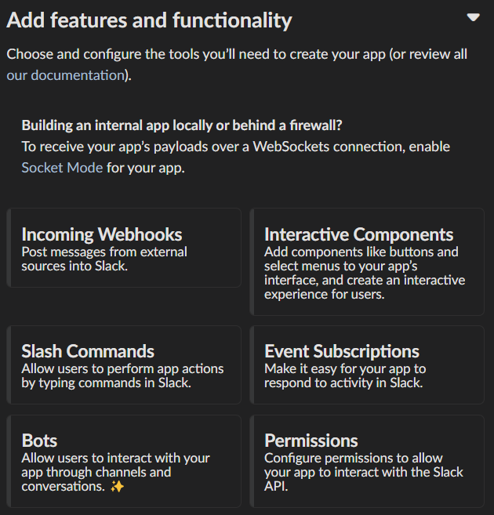

.. _start:

Installation and Getting Started
====================================

On this page, we will take you through the process of setting up PolicyKit, both for local development and on an Ubuntu server.

Local Development
-----------------

PolicyKit requires Python 3. Our guide recommends that you manage the repository with a Python 3+ virtual environment.

1. To begin, clone the `PolicyKit GitHub repository <https://github.com/amyxzhang/policykit>`_ (or your fork) and navigate to the repo directory:

.. code-block:: shell

	git clone https://github.com/policykit/policykit.git
	cd policykit

2. Install Python3, create a virtual environment for Policykit, and ensure your environment is using the latest version of pip:

.. code-block:: shell

	sudo apt install python3-pip python-venv
	python3 -m venv policykit_venv
	source policykit_venv/bin/activate
	pip install --upgrade pip

Your terminal prompt should change to look something like this ``(policykit_venv)user@host:/path/to/directory/policykit$`` after activating the virtual environment.

3. Navigate to the project's root directory and install PolicyKit's dependencies:

.. code-block:: shell

	cd policykit
	pip install -r requirements.txt

4. Next, run the following commands to create an ``.env`` file to store your settings and secrets:

.. code-block:: shell

	cd policykit
	cp .env.example .env

To run PolicyKit in production, you'll need to change some values in the ``.env`` file such as the ``DJANGO_SECRET_KEY`` and ``SERVER_URL``.

For local development, all you need to do is set ``DEBUG=true``.

5. Navigate up a directory and run the following command to create and set up the database:

.. code-block:: shell

	cd ..
	python3 manage.py migrate

By default, PolicyKit will create a sqlite3 database in the project's root directory. If you want to use another database, or if you want to change the database path, you can edit the ``DATABASES`` field in ``settings.py``. Documentation for editing this field can be found in the `Django docs <https://docs.djangoproject.com/en/4.1/ref/settings/#databases>`_.

6. Verify that you have setup the PolicyKit server correctly:

.. code-block:: shell

	python3 manage.py runserver

Open PolicyKit in the browser at http://localhost:8000/main. At this point, you won't be able to log in because PolicyKit currently only supports sign-in via external auth providers (Slack, Discord, Reddit, and Discourse).

There is an open issue to support logging in without any third-party platform: `#514 <https://github.com/amyxzhang/policykit/issues/514>`_.

To log in to PolicyKit, you'll need to install it on a server and set up at least 1 of the auth-enabled integrations.

Local Development (with docker)
-----------------

You can also deploy PolicyKit using Docker.

1. Make sure to have Docker and Docker Compose installed.

2. Clone the repo, navigate to the root and create a copy of ``policykit/policykit/.env.example`` as ``.env``:

   .. code-block:: shell

        cp policykit/policykit/.env.example .env

3. Create a ngrok account and [claim your free static domain](https://ngrok.com/blog-post/free-static-domains-ngrok-users).
   Then add your domain and auth token to the ``.env`` file:

.. code-block:: shell

        DOMAIN=xyz.ngrok-free.app
        NGROK_AUTHTOKEN=467...

4. Next, to create and set up the database run the following commands:

.. code-block:: shell

	docker compose run --rm web python3 manage.py makemigrations
        docker compose run --rm web python3 manage.py migrate
        docker compose run --rm web python3 manage.py

5. Finally, to run PolicyKit and all its services run:

.. code-block:: shell

	docker compose up

6. Then you can access PolicyKit in the browser at ``http://localhost:8000`` or ``https://<DOMAIN>``.

7. To be able to sign in, follow the steps below for setting up Slack. Use ``https://<DOMAIN>`` as your web address.

8. If you would like to try running with all the assets bunlded, as it is in production, run:

.. code-block:: shell

        docker compose run --rm frontend yarn build
        env DJANGO_VITE_DEV_MODE=False docker compose run --rm web python manage.py collectstatic
        env DJANGO_VITE_DEV_MODE=False docker compose up web

If you would like to save the DB:

.. code-block:: shell

        docker compose run --rm postgres env PGPASSWORD=password pg_dump -h postgres -Fc -U user policykit > local_db

And to restore it:

.. code-block:: shell

        docker compose run -T --rm postgres env PGPASSWORD=password pg_restore --clean --create --exit-on-error --no-privileges --no-owner -h postgres -U user --verbose -d postgres  < db_dump

If you have restored a database from a production server and want to pretend you are logged in as a user for testing, you can set the ``FORCE_SLACK_LOGIN`` variable in ``.env`` to the full name of a user
to force that user to always be logged in.

Running PolicyKit on a Server
-----------------------------

Thus far, we have run Policykit in Ubuntu 18.04 and Ubuntu 20.04. The instructions below should work for both.

1. Add PolicyKit to the server by uploading the codebase or using ``git clone`` in ``/var/www/`` or your directory of choice. This guide will assume that PolicyKit has been added to ``/var/www/``.

	.. code-block:: shell

		git clone https://github.com/policykit/policykit.git
		cd policykit

2. Install Python3, create a virtual environment for PolicyKit, and ensure your environment is using the latest version of pip:

	.. code-block:: shell

		sudo apt install python3-pip python3-venv
		python3 -m venv policykit_venv
		source policykit_venv/bin/activate
		pip install --upgrade pip

Your terminal prompt should change to look something like this ``(policykit_venv)user@host:/var/www/policykit$`` after activating the virtual environment.

3. Navigate to the project's root directory and install PolicyKit's dependencies:

	.. code-block:: shell

		cd policykit
		pip install -r requirements.txt

4. Next, run the following commands to create an ``.env`` file to store your settings and secrets:

	.. code-block:: shell

		cd policykit
		cp .env.example .env

5. Generate a secret key for Django using this command:

	.. code-block:: shell

		cd ..
		python3 manage.py shell -c 'from django.core.management import utils; print(utils.get_random_secret_key())'
		cd policykit

6. Make the following changes to ``.env``:

   - Set the ``DJANGO_SECRET_KEY`` field. Add the key that was generated in the last step
   - Set the ``SERVER_URL`` field.
   - Set the ``ALLOWED_HOSTS`` field to point to your host.
   - Make sure ``DEBUG`` is empty or set to false.
   - *Optional, if following the file system architecture used in this guide:* set the ``LOG_FILE`` field to ``/var/log/django/policykit/debug.log``
   - Be sure to uncomment these fields by removing the ``#`` at the start of a line.
   - You can leave the platform integration API keys/secrets empty for now. Follow the instructions below under `Set up Integrations`_ to set up each integration.

7. Navigate up a directory and run the following command to create and set up the database:

	.. code-block:: shell

		cd ..
		python3 manage.py migrate

By default, PolicyKit will create a sqlite3 database in the root directory. If you want to use another database, or if you want to change the database path, you can edit the ``DATABASES`` field in ``settings.py``. Documentation for editing this field can be found in the `Django docs <https://docs.djangoproject.com/en/4.1/ref/settings/#databases>`_.

8. Next, run the following command to collect static files into a ``static/`` folder:

	.. code-block:: shell

		python3 manage.py collectstatic

Deploy with Apache web server
^^^^^^^^^^^^^^^^^^^^^^^^^^^^^

Now that you have PolicyKit installed on your server, you can deploy it on Apache web server.

Make sure you have a domain dedicated to Policykit that is pointing to your server's IP address.

.. note::

	In the remaining examples in this section, make sure to substitute the following values used in the Apache config files with an absolute path:

        ``$POLICYKIT_REPO`` is the path to your policykit repository root. (i.e. ``/var/www/policykit``)

        ``$POLICYKIT_ENV`` is the path to your policykit virtual environment. (i.e.``/var/www/policykit/policykit_venv``)

        ``$SERVER_NAME`` is  your server name. (i.e. ``policykit.mysite.com``)

1. Install apache2 and the apache module Web Server Gateway Interface:

	.. code-block:: shell

        	sudo apt-get install apache2 libapache2-mod-wsgi-py3

2. Create a new apache2 config file:

	.. code-block:: shell

        	cd /etc/apache2/sites-available
        	# replace SERVER_NAME (i.e. policykit.mysite.com.conf)
        	cp default-ssl.conf SERVER_NAME.conf

3. Edit the config file to look like this:

	.. code-block:: aconf

        	<IfModule mod_ssl.c>
                	<VirtualHost _default_:443>
                        	ServerName $SERVER_NAME
                        	ServerAdmin webmaster@localhost
                        	Alias /static $POLICYKIT_REPO/policykit/static
                        	DocumentRoot $POLICYKIT_REPO

                        	# Grant access to the static site
                        	<Directory $POLICYKIT_REPO/policykit/static>
                                	Require all granted
                        	</Directory>

                        	# Grant access to wsgi.py file. This is the Django server.
                        	<Directory $POLICYKIT_REPO/policykit/policykit>
                                	<Files wsgi.py>
                                        	Require all granted
                                	</Files>
                        	</Directory>

                        	# Setup the WSGI Daemon
                        	WSGIDaemonProcess policykit python-home=$POLICYKIT_ENV python-path=$POLICYKIT_REPO/policykit
                        	WSGIProcessGroup policykit
                        	WSGIScriptAlias / $POLICYKIT_REPO/policykit/policykit/wsgi.py
                        	# .. REST ELIDED
                	</VirtualHost>
        	</IfModule>

4. Test your config with ``apache2ctl configtest``. You should get "Syntax OK" as a response.

5. Enable your site:

	.. code-block:: shell

		# activate your config
		a2ensite /etc/apache2/sites-available/$SERVER_NAME.conf

		# disable the default ssl config
		sudo a2dissite default-ssl.conf

6. Get an SSL certificate and set it up to auto-renew using LetsEncrypt:

	.. code-block:: shell

		sudo apt install certbot python3-certbot-apache
		sudo certbot --apache

7. Add the certificates to your ``$SERVER_NAME.conf`` file (certbot may auto-inject this code at the bottom of your .conf):

	.. code-block:: aconf

		SSLCertificateFile /etc/letsencrypt/live/$SERVER_NAME/fullchain.pem
		SSLCertificateKeyFile /etc/letsencrypt/live/$SERVER_NAME/privkey.pem

8. Reload the config:

	.. code-block:: shell

		systemctl reload apache2

9. Give the Apache2 user (aka ``www-data``) access to the Django log directory and the database directory. Update paths as needed based on personal setup:

	.. code-block:: shell

        	sudo chown -R www-data:www-data /var/log/django/policykit/
        	sudo chown -R www-data:www-data /var/databases/policykit/

10. Load your site in the browser and navigate to ``/login``. You should see a site titled "PolicKiy Administration" with options to connect to Slack, Discourse, and Discord. Before you can install PolicyKit into any of these platforms, you'll need to set the necessary Client IDs and Client Secrets in ``.env``. Follow the setup instructions for these and other integrations in :doc:`Integrations <integrations>`.

  Check for errors at ``/var/log/apache2/error.log`` and ``/var/log/django/policykit/debug.log`` (or whatever logging path you set in ``.env``).

11. Any time you update the code, you'll need to run ``systemctl reload apache2`` to reload the server.

Set up Celery
^^^^^^^^^^^^^

PolicyKit uses `Celery <https://docs.celeryproject.org/en/stable/index.html>`_ to run scheduled tasks. Follow these instructions to run a celery daemon on your Ubuntu machine using ``systemd``. For more information about configuration options, see `Celery Daemonization <https://docs.celeryproject.org/en/stable/userguide/daemonizing.html>`_.

Create celery user
""""""""""""""""""

If you don't already have a ``celery`` user, create one:

.. code-block:: bash

        sudo useradd celery -d /home/celery -b /bin/bash

Give the ``celery`` user access to necessary pid and log folders:

.. code-block:: bash

        sudo useradd celery -d /home/celery -b /bin/bash
        sudo mkdir /var/log/celery
        sudo chown -R celery:celery /var/log/celery
        sudo chmod -R 755 /var/log/celery

        sudo mkdir /var/run/celery
        sudo chown -R celery:celery /var/run/celery
        sudo chmod -R 755 /var/run/celery

The ``celery`` user will also need write access to the Django log file and the database. To give ``celery`` access, create a group that contains both ``www-data`` (the apache2 user) and ``celery``. For example, if your Django logs are in ``/var/log/django`` and your database is in ``/var/databases``:

.. code-block:: bash

        sudo groupadd www-and-celery
        sudo usermod -a -G www-and-celery celery
        sudo usermod -a -G www-and-celery www-data

        # give the group read-write access to logs
        sudo chgrp -R www-and-celery /var/log/django/policykit
        sudo chmod -R 775 /var/log/django/policykit

        # give the group read-write access to database (if using sqlite)
        sudo chgrp -R www-and-celery /var/databases/policykit
        sudo chmod -R 775 /var/databases/policykit

Create Celery configuration files
"""""""""""""""""""""""""""""""""

Next, you'll need to create three Celery configuration files for PolicyKit

.. note::

        Remember to substitute the following variables with an absolute path:

        ``$POLICYKIT_ENV`` is the path to your policykit virtual environment. (i.e. ``/var/www/policykit/policykit_venv``)

        ``$POLICYKIT_REPO`` is the path to your policykit repository root. (i.e. ``/var/www/policykit``)

``/etc/conf.d/celery``
""""""""""""""""""""""

.. code-block:: bash

        CELERYD_NODES="w1"

        # Absolute or relative path to the 'celery' command:
        CELERY_BIN="$POLICYKIT_ENV/bin/celery"

        # App instance to use
        CELERY_APP="policykit"

        # How to call manage.py
        CELERYD_MULTI="multi"

        # Extra command-line arguments to the worker
        CELERYD_OPTS="--time-limit=300 --concurrency=8"

        # - %n will be replaced with the first part of the nodename.
        # - %I will be replaced with the current child process index
        #   and is important when using the prefork pool to avoid race conditions.
        CELERYD_PID_FILE="/var/run/celery/%n.pid"
        CELERYD_LOG_FILE="/var/log/celery/%n%I.log"
        CELERYD_LOG_LEVEL="INFO"

        # you may wish to add these options for Celery Beat
        CELERYBEAT_PID_FILE="/var/run/celery/beat.pid"
        CELERYBEAT_LOG_FILE="/var/log/celery/beat.log"

``/etc/systemd/system/celery.service``
""""""""""""""""""""""""""""""""""""""

.. code-block:: bash

        [Unit]
        Description=Celery Service
        After=network.target

        [Service]
        Type=forking
        User=celery
        Group=celery
        EnvironmentFile=/etc/conf.d/celery
        WorkingDirectory=$POLICYKIT_REPO/policykit
        ExecStart=/bin/sh -c '${CELERY_BIN} multi start ${CELERYD_NODES} \
        -A ${CELERY_APP} --pidfile=${CELERYD_PID_FILE} \
        --logfile=${CELERYD_LOG_FILE} --loglevel=${CELERYD_LOG_LEVEL} ${CELERYD_OPTS}'
        ExecStop=/bin/sh -c '${CELERY_BIN} multi stopwait ${CELERYD_NODES} \
        --pidfile=${CELERYD_PID_FILE}'
        ExecReload=/bin/sh -c '${CELERY_BIN} multi restart ${CELERYD_NODES} \
        -A ${CELERY_APP} --pidfile=${CELERYD_PID_FILE} \
        --logfile=${CELERYD_LOG_FILE} --loglevel=${CELERYD_LOG_LEVEL} ${CELERYD_OPTS}'

        [Install]
        WantedBy=multi-user.target

``/etc/systemd/system/celerybeat.service``
""""""""""""""""""""""""""""""""""""""""""

.. code-block:: bash

        [Unit]
        Description=Celery Beat Service
        After=network.target

        [Service]
        Type=simple
        User=celery
        Group=celery
        EnvironmentFile=/etc/conf.d/celery
        WorkingDirectory=$POLICYKIT_REPO/policykit
        ExecStart=/bin/sh -c '${CELERY_BIN} -A ${CELERY_APP}  \
        beat --pidfile=${CELERYBEAT_PID_FILE} \
        --logfile=${CELERYBEAT_LOG_FILE} --loglevel=${CELERYD_LOG_LEVEL} \
        --schedule=/var/run/celery/celerybeat-schedule'

        [Install]
        WantedBy=multi-user.target

After creating the files (and after any time you change them) run the following command:

::

 sudo systemctl daemon-reload

Next, install RabbitMQ, a message broker:

::

 sudo apt-get install erlang rabbitmq-server

Enable and start the RabbitMQ service:

::

 sudo systemctl enable rabbitmq-server
 sudo service rabbitmq-server start

Check the status to make sure everything is running smoothly:

::

 systemctl status rabbitmq-server

Finally, run the following commands to start the celery daemon:

::

 sudo systemctl start celery celerybeat

Verify that there are no errors with celery and celerybeat by running these commands:

::

 sudo systemctl status celery
 sudo systemctl status celerybeat

Troubleshooting
"""""""""""""""
If celery or celerybeat fail to start up as a service, try running celery directly to see if there are errors in your code:

::

 celery -A policykit worker -l info --uid celery
 celery -A policykit beat -l info --uid celery --schedule=/var/run/celery/celerybeat-schedule

If celerybeat experiences errors starting up, check the logs at ``/var/log/celery/beat.log``.

Interactive Django Shell
^^^^^^^^^^^^^^^^^^^^^^^^

The interactive Django shell can be useful when developing and debugging PolicyKit. Access the Django shell with ``python manage.py shell_plus``. Some useful shell commands for development:

.. code-block:: bash

        # List all communities
        Community.objects.all()

        # List CommunityPlatforms for a specific community
        community = Community.objects.first()
        CommunityPlatform.objects.filter(community=community)

        # Get all pending proposals
        Proposal.objects.filter(status="proposed")

        # Manually run the policy checking task that is executed on a schedule by Celery
        from policyengine.tasks import evaluate_pending_proposals
        evaluate_pending_proposals()

        ###### Advanced Commands for debugging Metagov ######

        # Access the Metagov Community model
        from metagov.core.models import Community as MetagovCommunity
        MetagovCommunity.objects.all()
        MetagovCommunity.objects.get(slug=community.metagov_slug)

        # Access the Metagov Plugin models (1:1 with CommunityPlatform)
        Plugin.objects.all()
        Slack.objects.all()
        Plugin.objects.filter(community__slug=community.metagov_slug)

        # Get pending Metagov GovernanceProcesses
        GovernanceProcess.objects.filter(status='pending')
        GovernanceProcess.objects.filter(plugin__community=metagov_community)
        SlackEmojiVote.objects.filter(status='pending', plugin__community__slug="my-slug")

.. _Set up Integrations:
Set up Integrations
^^^^^^^^^^^^^^^^^^^

Before your instance of PolicyKit can be installed onto external platforms,
you'll need to go through setup steps for each integration that you want to support.

See the :doc:`Integrations <integrations>` page for a list of PolicyKit capabilities supported by each platform integration.

Slack
"""""
The Slack integration is facilitated through the Metagov plugin.

Slack requires an initial setup process to create bots/apps and allow the developer to store Slack Client IDs and Secrets on the PolicyKit server.

Begin by creating a new app.

**Creating a New App**

Visit https://api.slack.com/apps and click the "Create New App" button, and then select the "From scratch" option.

Give your app a name and pick a workspace to develop your app in.

You must be the admin of the workspace to add a new app. If you are not an admin of any current workspace you can create a new workspace.

Go to the "Basic Information" page and under "Building Apps for Slack", expand the "Add features and functionality section". We will work our way through each subsection detailing how to configure your application.

**Incoming Webhooks**

Activate the toggle from off to on in this section.

**Interactive Components**

Activate the toggle from off to on in this section.

Enter the following URL in the Request URL box (changing $SERVER_NAME for the server url you setup above): ``https://$SERVER_NAME/api/hooks/slack``

**Slash Commands**

No changes needed.

**Event Subscriptions**

Activate the toggle from off to on in this section.

Enter the following URL in the Request URL box (changing $SERVER_NAME for the server url you setup above): ``https://$SERVER_NAME/api/hooks/slack``

Bots
""""""""""""""""""""""""""""""""""""""""""""""""""""

Activate the toggle from off to on for Always Show My Bot as Online.

**Permissions**

Enter the following URL in the Redirected URLs bot in the Redirect URLs section (changing $SERVER_NAME for the server url you setup above): ``https://$SERVER_NAME/auth/slack/callback``

We recommend adding the following scopes to your app for testing PolicyKit with Slack. Remove unnecessary scopes after testing:

**Bot Token Scopes**

- ``app_mentions:read``
- ``channels:history``
- ``channels:join``
- ``channels:manage``
- ``channels:read``
- ``chat:write``
- ``chat:write.customize``
- ``chat:write.public``
- ``commands``
- ``dnd:read``
- ``emoji:read``
- ``files:read``
- ``groups:read``
- ``groups:write``
- ``im:history``
- ``im:read``
- ``im:write``
- ``incoming-webhook``
- ``links:read``
- ``links:write``
- ``mpim:history``
- ``mpim:read``
- ``mpim:write``
- ``pins:read``
- ``pins:write``
- ``reactions:read``
- ``reactions:write``
- ``team:read``
- ``usergroups:read``
- ``usergroups:write``
- ``users.profile:read``
- ``users:read``
- ``users:read.email``
- ``users:write``

**User Token Scopes**

- ``chat:write``
- ``reactions:read``

**Install Your App**

After defining scopes you are able to install your app to your Slack workspace to test it and generate API tokens.

Go back to the "Basic Information" page and expand the "Install your App section". Then click "Install to Workspace".

**Setting Your .env**

Under the "Basic Information" section are your app credentials, including the ``App ID``, ``Client ID``, ``Client Secret``, and ``Signing Secret``.

Add these values to your ``.env`` in ``$POLICY_REPO/policykit/policykit/.env``

Reload the Apache server

::

 systemctl reload apache2

**Connecting PolicyKit to Your Slack App**

You can now visit your PolicyKit login page ``$SERVER_NAME/login`` and "Install Policykit to Slack".

You will be prompted to authorize the the app to access your workspace.

After authorizing, you will be presented with three options for governance systems to start with:

- Testing
- Dictator
- Moderators

For more information on how to manage policies in PolicyKit see :doc:`Design Overview <design_overview>` and :doc:`Writing Policies <writing_policies>`

**Production Considerations and Public Distribution**

If you plan to allow other Slack workspaces to use your PolicyKit server, you will need to change your Slack app from private to public distribution. Slack has a guide for `distributing your app publicly <https://api.slack.com/start/distributing/public>`_.

Discord
"""""""
The Discord integration occurs through Metagov. Instructions for how to setup the plugin for Metagov Discord to be written.

Discourse
"""""""""

There is no admin setup required for Discourse. Each Discourse community that installs PolicyKit needs to register the PolicyKit auth redirect separately.

Reddit
""""""

1. Create a new app at https://www.reddit.com/prefs/apps
2. Set the ``REDDIT_CLIENT_SECRET`` in ``private.py``.
3. Reload apache2: ``systemctl reload apache2``

Developing the Metagov Gateway
------------------------------

If you're making changes to the `Metagov Gateway <https://docs.metagov.org/>`_ and want to test those changes in PolicyKit, you have two options:

   1. Push your changes to a branch or fork, and update ``requirements.txt`` in PolicyKit to point to it:

     .. code-block:: bash

        -e git+https://github.com/metagov/gateway.git@<your-dev-branch>#egg=metagov&subdirectory=metagov

   2. Use pip "editable" installs to point to your local Metagov Gateway codebase:

     .. code-block:: bash

        pip install -e /path/to/gateway/repo/metagov

Profiling
---------

If you are trying to develop PolicyKit and notice that a certain view is slow, we have integrated two extensions to help
with profiling.

If the view is a Django HTML view, then you can use `Django Debug Toolbar <https://github.com/django-commons/django-debug-toolbar>`_
to inspect the SQL queries performed. To enable it set the ``DJANGO_DEBUG_TOOLBAR`` env variable to ``True`` (the default
when developing with Docker).

If the view is REST API, then you can use `Django Silk <https://github.com/jazzband/django-silk>`_. To enable it
set ``DJANGO_SILK`` to ``True`` (again the default in Docker) and load the API. It will then be recorded in the database
and you can see the results by accessing the ``/silk/`` endpoint. If you would like to generate a profile for the view,
`decorate it with ``@silk.profiling.profiler.silk_profile`` <https://github.com/jazzband/django-silk?tab=readme-ov-file#decorator>`_.
